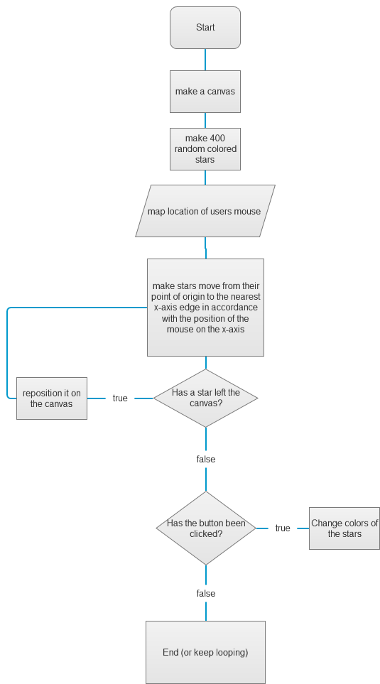

# [ N O W_E N T E R I N G_W A R P S P E E D ]

link: https://oorthianemissary.github.io/mini_ex8/

I selected the first coding challenge Daniel Shiffman did. It reminded me of one of the first pieces of art installations that were refered to in class, namely Tiny Star Field by Katie Rose Pipkin. 
Link to the Tine Star Fields: https://twitter.com/tiny_star_field?lang=en

I changed some of the syntax, so the stars, instead of being white became colored. I also added a button, which changes these colors for each of the stars. It's by far standards a very simple change. The most noticable thing is the button that changes the stars colors. By default it would have been placed besides the canvas, but since the stars gain speed in accordance with the position of mouseX, changing colors for them, would not have mattered then, as they would "rush past" too quickly. Therefore it is in the top left corner, as to decrees mouseX, thus enabling the function to have meaning at all. Thus the two parts of the code are separated, so that they might serve each their own purpose.
Link to the first challenge: https://www.youtube.com/watch?v=17WoOqgXsRM&list=PLRqwX-V7Uu6ZiZxtDDRCi6uhfTH4FilpH&index=1

The difficulty was not much the coding itself. Personally it was being sick most of the week. Besides that doing doing framework as a flowchart was somewhat of a different approach to my more "emerging" coding style, where I generally set out with some idea, but I let it evolve as I go along. Another difficulty with this exercise was trying to understand other peoples code. Of course when you make your own, you know what's what and which lines does what, but since code is rather deciphered, in a lot of cases instead of read, it takes time to understand, and probably explanation too.

The flowchart gives an overview to how we might structure and run our program as well as optimize it for maximum performance. It is thus good for large pieces of work with a clear intention in mind. Flowcharts can be made as an inquiry into systems in the code as well as the code itself and as such have different levels of detail that will in each level help the development process. For these reasons it is a powerful tool for most coding practices.
However, as a way to set a frame for the program and its parts, before anything is coded, restricts, but does not remove, the mutating properties of Making (capital M as to capitalize on the human affordance and trait to make things. Arguably on of the most human things to do alongside Destroying). The restriction resides within way flowcharts frames how the code should be. It becomes more like building from a blueprint than setting out on a journey of coding. The mutations and different quirks that might appear as code is added is less exposed, as the programmer works towards a goal. Thus for more "mutating" styles of coding, making a flowchart of the whole program defeats the purpose. Flowcharts can of course, and probably wil, be used in conjunction with the more loose "mutating" style of coding, as the flowchart will be reviewed alongside the code throughout the process.
Note: Should a programmer be more into a "mutating"-style of programming, a flowchart makes for a great tool to clean up afterwards.
